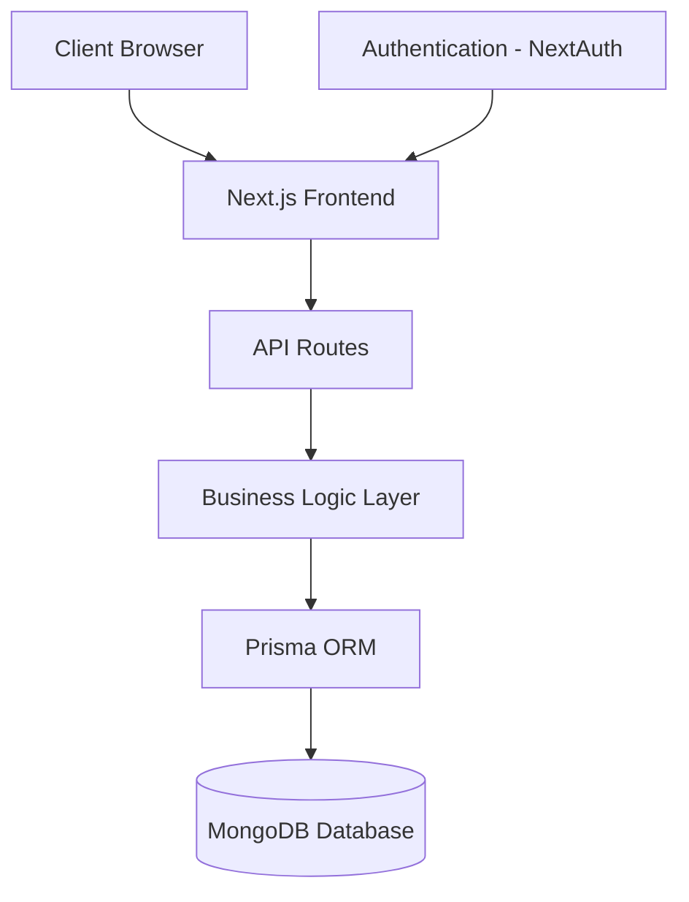

<div align="center">

# 🚀 ERP System

### Enterprise Resource Planning System

[](https://www.typescriptlang.org/)
[](https://developer.mozilla.org/en-US/docs/Web/JavaScript)
[](https://nextjs.org/)
[](https://www.prisma.io/)
[](https://www.mongodb.com/)
[](https://tailwindcss.com/)

</div>

---

## 🌟 Overview

This ERP system provides a centralized platform to manage business operations including user management, inventory, sales, finance, and workflow processes.

It is built using **Next.js, TypeScript, Prisma ORM, and MongoDB**, following a modular and scalable architecture.

> 🚧 Project is under active development.

---

## ✨ Features

### 📊 Dashboard
- Real-time business metrics
- Summary cards and data visualization
- Role-based data visibility

### 👥 User Management
- Role-based access control (Admin, Manager, Employee, Viewer)
- Authentication using NextAuth
- User activity tracking

### 🏢 Organization Management
- Multi-company structure
- Department and team management

### 📦 Inventory Management
- Add, update, delete inventory items
- Stock quantity tracking
- SKU & category management

### 💰 Sales Management
- Create new sales
- Automatic total calculation
- Inventory validation before sale
- Sales status tracking (Pending / Completed / Cancelled)

### 💵 Finance Module
- Transaction recording
- Financial reports
- Budget tracking

### 🔄 Workflow & Notifications
- Approval flows
- Task management
- Notification system

---

## 🛠️ Tech Stack

### Frontend
- Next.js 13
- React
- TypeScript
- Tailwind CSS
- Shadcn UI

### Backend
- Node.js
- Prisma ORM
- MongoDB
- NextAuth (Authentication)

### Deployment
- Vercel
- GitHub Actions
- Docker (optional)

---

## 🏗️ System Architecture



---

## 🚀 Installation

### Prerequisites
- Node.js v18+
- MongoDB instance

### Setup

```bash
git clone https://github.com/kajal801034-creator/ERP-AI
cd ERP-AI
npm install
```

### Configure Environment Variables

Create `.env` file:

```
DATABASE_URL="mongodb+srv://..."
NEXTAUTH_SECRET="your-secret"
NEXTAUTH_URL="http://localhost:3000"
```

### Setup Database

```bash
npx prisma generate
npx prisma db push
```

### Run Development Server

```bash
npm run dev
```

App runs on:

```
http://localhost:3000
```

---

## 🖥️ Usage

### Roles Supported

- **Administrator** – Full access
- **Manager** – Department-level access
- **Employee** – Limited access
- **Viewer** – Read-only access

---

## 📚 API

- RESTful API routes
- JWT-based authentication
- Inventory & Sales endpoints
- Role-based middleware protection

---

## 📄 License

MIT License

---

<div align="center">

Made with ❤️ by **Kajal Kumari**

</div>
